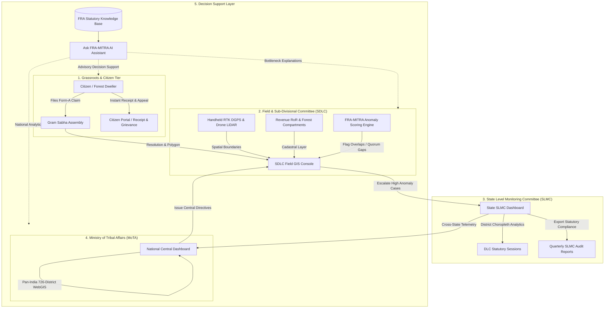
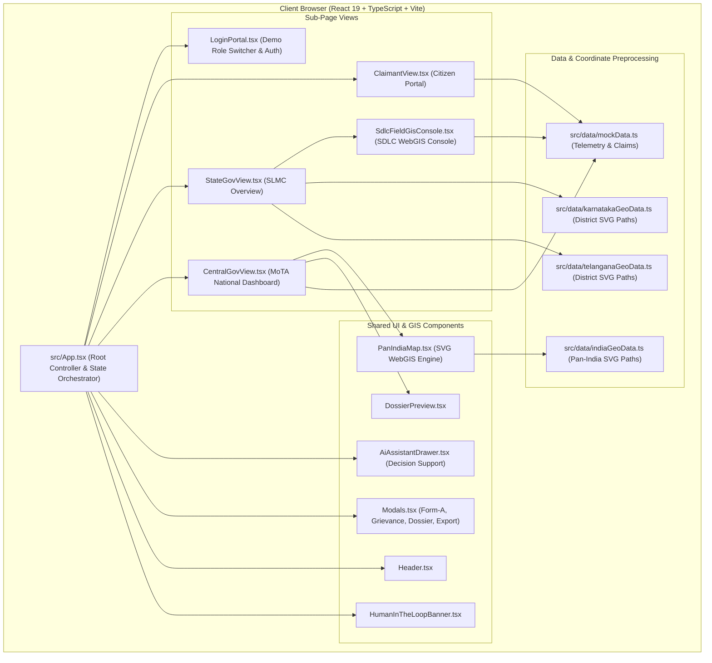
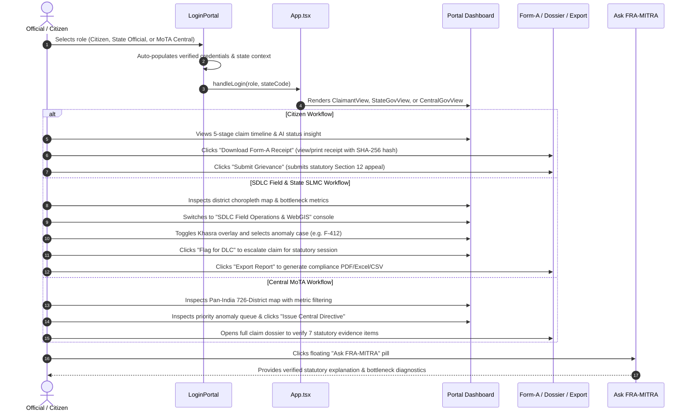

# FRA-MITRA 🌲

> **AI-Powered WebGIS Decision Support System for Forest Rights Act (FRA) 2006 Monitoring, Boundary Dispute Detection, and Title Tracking Across Citizen, SDLC, State, and National Governance Tiers.**

[](https://www.typescriptlang.org/)
[](https://react.dev/)
[](https://vite.dev/)
[](https://tailwindcss.com/)
[-22C55E)](package.json)

---

## Overview

**FRA-MITRA** (*Forest Rights Act – Monitoring, Intelligence, Titling & Resolution Assistant*) is a multi-tier GovTech decision support platform engineered to modernize the administration of India's **Scheduled Tribes and Other Traditional Forest Dwellers (Recognition of Forest Rights) Act, 2006** (FRA 2006).

While the statutory objective of the FRA is to recognize pre-existing ancestral land and forest resource rights of tribal and traditional forest-dwelling communities, the on-ground implementation has historically suffered from high rejection rates, protracted administrative pendency, conflicting spatial boundaries, and fragmented paper trails between Gram Sabhas and district committees.

FRA-MITRA bridges this governance gap by combining **client-side WebGIS choropleth rendering**, **automated anomaly detection**, **statutory case dossier tracking**, and a **frosted glassmorphic decision support interface**. The platform unites three distinct governance tiers—**Citizen/Claimant**, **State Monitoring Committees (SLMC) & Sub-Divisional Committees (SDLC)**, and the **Ministry of Tribal Affairs (MoTA)**—into a synchronized, transparent operational loop.

---

## Problem Statement

Across India's forest districts, over 4.4 million claims have been filed under the Forest Rights Act, yet administrative bottlenecks severely restrict timely and equitable title conferment:

1. **High Rejection Bottlenecks Without Spatial Justification:**
   In states such as Karnataka, rejection rates historically exceed 80–89% (over 262,000 rejected claims out of 295,000 filed), often due to vague citations such as lack of pre-2005 documentary proof or undocumented forest reserve overlap without DGPS ground-truthing.
2. **Pendency Backlogs Exceeding Statutory Timelines:**
   Claims regularly languish for over 180 days across the Sub-Divisional Level Committee (SDLC) and District Level Committee (DLC) stages without transparent progress indicators for claimants.
3. **Spatial & Record-of-Rights (RoR) Discrepancies:**
   Traditional Podu cultivation plots and Western Ghats boundaries frequently conflict with legacy forest compartment maps. Satellite change detection and cadastral boundaries are rarely accessible to field survey teams simultaneously.
4. **Gram Sabha Quorum & Procedural Omissions:**
   Statutory rules (such as FRA Rule 4(1) mandating 50% adult attendance with at least 33% female representation in Gram Sabha resolutions) are difficult to verify retroactively without centralized digital audit logs.
5. **Information Asymmetry:**
   Claimants have virtually no digital window to track application progress, verify attached statutory evidence, download formal acknowledgement receipts, or lodge statutory Section 12 appeals.

---

## Solution

FRA-MITRA delivers a digital governance cockpit connecting grassroots claimants with district survey units, state administrations, and national policymakers:



---

## Key Features

### 1. Citizen & Claimant Portal (`ClaimantView`)
* **5-Stage Statutory Tracker:** Real-time visual pipeline tracking progress from Application filed $\rightarrow$ Verification $\rightarrow$ Gram Sabha Approval $\rightarrow$ DLC Statutory Verification $\rightarrow$ Final Title (Patta) Conferment.
* **Form-A Statutory Receipt Generation:** Instant statutory acknowledgement modal with claimant information, revenue plot number, claimed extent, forest beat/compartment details, and a cryptographic SHA-256 WebGIS hash.
* **Statutory Grievance Filing:** Built-in FRA Section 12 appeal workflow allowing citizens to submit grievances regarding verification delays, GPS boundary mismatches, or quorum disputes.
* **AI Status Explanations:** Plain-language insight modules explaining why a claim is delayed (e.g., GPS geofence variance in Gundala sector) with confidence scoring.

### 2. SDLC Field Operations & WebGIS Console (`SdlcFieldGisConsole`)
* **Cadastral & Anomaly WebGIS:** Vector map displaying survey points, Khasra plot boundaries, anomaly risk pins, and forest beat compartments with layer toggles (Heatmap, Khasra Cadastre, Satellite Base).
* **Priority Anomaly Queue:** Real-time triage feed scoring claims from 0.0 to 10.0 based on risk factors (delay $>180$ days, Podu land revenue mismatch, boundary overlap with reserve forest).
* **Interactive Map Inspector:** Floating case inspector displaying supporting evidence, assigned field team, automated operational recommendations, and direct one-click action to flag claims for upcoming DLC statutory sessions.
* **Statutory Meeting Scheduler:** Dynamic field reminder tracking scheduled joint verification dates and dossiers prepared for Gram Sabha synchronization.

### 3. State Level Monitoring Committee Dashboard (`StateGovView`)
* **Dual-State Spatial Analytics:** Dedicated monitoring for **Karnataka** (Western Ghats forest divisions) and **Telangana** (Agency tracts and Podu land divisions).
* **District Choropleth WebGIS:** Interactive SVG choropleth highlighting clearance districts, pending backlogs, and anomaly hotspots (e.g., Shimoga, Uttara Kannada, Bhadradri Kothagudem, Adilabad).
* **Comparative Processing Breakdown:** Interactive stack bars charting conferment, pendency, and rejection percentages per district.
* **AI Bottleneck Diagnosis:** Automated synthesis identifying state-specific failure points (e.g., Karnataka's 89% rejection bottleneck vs. Telangana's 50.3% pending backlog).
* **Audit Report Exporter:** Modal supporting one-click exports of quarterly statutory compliance documents in PDF, Excel, and CSV formats.

### 4. Ministry of Tribal Affairs (MoTA) National Dashboard (`CentralGovView`)
* **Pan-India Registry Scope:** Macro-level monitoring across 36 States/UTs and 726 districts.
* **Interactive Pan-India Vector Map (`PanIndiaMap`):** SVG map supporting Pan, Zoom ($0.8\times$ to $4.0\times$), State/District drill-down, search filtering, and metric mode switching (Title Conferment Rate, Pending Backlog, AI Anomaly Flags).
* **Ground-Truthing Technology Adoption Telemetry:** Real-time tracking of RTK DGPS receiver deployment, dense canopy drone LiDAR surveys, and Gram Sabha digital geo-tagging sync rates.
* **Central Directives Engine:** National nodal officers can issue statutory mandates (e.g., mandating joint DGPS re-surveys with a 15-day SLA) directly impacting field queues.
* **Integrated Case Dossier Inspector (`DossierPreview`):** Side-by-side dossier viewer with quick plot ID copy, boundary coordinate previews, and statutory evidence checklists.

### 5. AI Decision Support System ("Ask FRA-MITRA" Drawer)
* **Context-Aware Decision Support:** Conversational assistant grounded in statutory FRA 2006 guidelines and the repository's verified telemetry dataset.
* **Quick Query Chips:** One-tap investigation shortcuts for specific claims (e.g., *Explain delay on Claim F-412*), state summaries (*Karnataka stats*, *Telangana stats*), and national metrics.
* **Statutory Human-in-the-Loop Protocol:** Transparent interface banner reminding officers that AI outputs are advisory decision support and final title recognition requires statutory officer sign-off.

### 6. Refined Glassmorphic Design System
* **Brand Color Palette:**
  * **Primary Deep Green (`#2A7C13`)**: Headers, primary actions, positive metrics, visual anchors.
  * **Accent Leaf Green (`#76C457`)**: Progress indicators, verified badges, active pill rings.
  * **Base Light Warm Cream (`#FFF8CF`)**: Ambient background canvas and card surface tinting.
  * **Soft Warm Amber (`#FBE6C2`)**: Secondary card fills, warning tags, meeting alerts.
* **Tactile Frosted Glass:** `backdrop-filter: blur(12px) saturate(160%)`, beveled translucent borders (`1px solid rgba(255,255,255,0.75)`), standardized KPI card geometry (`16px 20px` padding), and WCAG AA contrast compliance.

---

## System Architecture



---

## Technology Stack

| Layer | Technology | Purpose |
| :--- | :--- | :--- |
| **Frontend Framework** | React 19 (`19.0.1`) | Component architecture, state management, and DOM rendering |
| **Language** | TypeScript 5.8 (`~5.8.2`) | Strict static type checking and domain model enforcement |
| **Build & Dev Tool** | Vite 6 (`6.2.3`) | Fast HMR dev server and production bundling |
| **CSS & Design System** | Tailwind CSS v4 (`@tailwindcss/vite 4.1.14`) | Utility-first CSS engine with custom glassmorphism design tokens |
| **Icons** | Lucide React (`0.546.0`) | Semantic UI icons across dashboards and GIS consoles |
| **Motion & Micro-interactions** | Motion (`motion 12.23.24`) | Smooth UI transitions and toast animations |
| **GIS Vector Pipeline** | Node.js GeoJSON Preprocessor Scripts | Offline Mercator projection of GeoJSON boundaries into SVG paths |
| **AI Integration** | `@google/genai` (`^2.4.0`) | Client-side/server-side Gemini API hooks for AI decision support |

---

## Project Structure

```
origin/
├── .env.example              # Environment variable template (Gemini API & App URL)
├── index.html                # HTML5 entry point with Plus Jakarta Sans & Inter fonts
├── package.json              # Project dependencies, build, lint, and dev scripts
├── vite.config.ts            # Vite 6 config with React & Tailwind CSS v4 plugins
├── tsconfig.json             # TypeScript 5.8 compiler configuration
├── bg.png                    # Forest imagery asset used in Login Portal
│
├── public/                   # Static assets served directly
│   ├── bg.png                # Fallback background image
│   └── india.geojson         # Reference boundary dataset for GIS vector pipeline
│
├── scripts/                  # Offline coordinate projection tools
│   ├── buildGeo.cjs          # Projects india.geojson to SVG coordinates in indiaGeoData.ts
│   ├── buildKarnatakaGeo.cjs # Projects Karnataka district boundaries to SVG paths
│   └── buildTelanganaGeo.cjs # Projects Telangana district boundaries to SVG paths
│
└── src/                      # Application source code
    ├── main.tsx              # React DOM root entry point
    ├── App.tsx               # Top-level view router, role management, and modal orchestration
    ├── index.css             # Brand tokens, Frosted Glass CSS system, custom scrollbars
    ├── types.ts              # TypeScript interfaces for Claims, Districts, Roles, Notifications
    │
    ├── components/           # UI and domain components
    │   ├── LoginPortal.tsx   # SwasthyaSetu-styled login portal with prefilled demo credentials
    │   ├── Header.tsx        # Multi-role navigation bar with notification dropdown & user profile
    │   ├── HumanInTheLoopBanner.tsx # Mandatory statutory advisory compliance banner
    │   ├── ClaimantView.tsx  # Citizen / Forest Dweller claim dashboard & 5-stage timeline
    │   ├── StateGovView.tsx  # State SLMC overview, choropleth maps, and bottleneck analysis
    │   ├── SdlcFieldGisConsole.tsx # SDLC field ground-truthing, cadastral pins, priority queue
    │   ├── CentralGovView.tsx# MoTA national dashboard, tech adoption rates, directives
    │   ├── PanIndiaMap.tsx   # Interactive Pan-India SVG WebGIS map with zoom/pan/filtering
    │   ├── DossierPreview.tsx# Case dossier inspector drawer with evidence checklists
    │   ├── Modals.tsx        # Form-A receipt, Grievance filing, Dossier detail, Report export
    │   ├── AiAssistantDrawer.tsx # Floating "Ask FRA-MITRA" decision support assistant
    │   └── Footer.tsx        # Government portal footer and statutory disclaimer
    │
    └── data/                 # Data stores & projected GIS coordinates
        ├── mockData.ts       # Mock claims, priority anomaly queues, district statistics
        ├── indiaGeoData.ts   # Projected SVG vector path coordinates for Pan-India states
        ├── karnatakaGeoData.ts # Projected SVG vector coordinates for Karnataka districts
        └── telanganaGeoData.ts # Projected SVG vector coordinates for Telangana districts
```

---

## How It Works

### Step-by-Step User Journey



---

## Getting Started

### Prerequisites

* **Node.js**: Version `18.0.0` or higher (Node `20+` recommended)
* **Package Manager**: `npm` (v9+), `pnpm`, or `bun` (v1.2+)
* **Browser**: Any modern browser supporting Web standards (Chrome, Edge, Firefox, Safari)

### Installation

1. **Clone the repository:**
   ```bash
   git clone https://github.com/SanchitMaheshwari/ORIGIN.git
   cd ORIGIN
   ```

2. **Install dependencies:**
   ```bash
   # Using npm:
   npm install

   # Or using bun:
   bun install
   ```

3. **Configure Environment Variables (Optional):**
   Copy the example environment file if integrating with Gemini API in AI Studio:
   ```bash
   cp .env.example .env
   ```
   *Note: The platform is fully equipped with an integrated in-memory knowledge base and mock datasets; it runs completely out of the box without requiring external API keys.*

---

## Running the Application

Start the local Vite development server:

```bash
# Using npm:
npm run dev

# Or using bun:
bun run dev
```

Once started, the application will be accessible at:
* **Local:** `http://localhost:3000/`
* **Network:** `http://<your-local-ip>:3000/`

---

## Usage & Demo Walkthrough

Upon opening `http://localhost:3000/`, you are greeted by the **SwasthyaSetu-styled FRA-MITRA GovTech Portal**. Use the pre-configured role tabs to explore each workflow:

### Demo Personas & Credentials

| Role | Demo Identity | Pre-Filled Identifier | Pre-Filled Password | Core Capabilities to Test |
| :--- | :--- | :--- | :--- | :--- |
| **Citizen Claimant** | Somla Naik (*IFR Claimant, Allapalli, Telangana*) | `9876543210` | `OTP-2026` | • Track 5-stage timeline<br>• Download Form-A receipt with SHA-256 hash<br>• Submit Section 12 Grievance appeal |
| **State Official (Karnataka)** | Dr. K. Manjunath, IAS (*Member Secretary, SLMC Karnataka*) | `SDLC-KA-2026-884` | `KAGov@2026` | • Western Ghats choropleth map<br>• 89% rejection bottleneck diagnosis<br>• SDLC WebGIS ground-truthing console<br>• Export quarterly SLMC report |
| **State Official (Telangana)** | District Nodal Officer (*Bhadradri Kothagudem*) | `SDLC-TG-2026-441` | `TGGov@2026` | • Podu land overlap telemetry<br>• 50.3% pending backlog triage<br>• Flag anomaly claim for DLC session |
| **National MoTA Central** | Rahul Sharma, IAS (*Joint Secretary, MoTA New Delhi*) | `MOTA-HQ-9901` | `MoTA#India2026` | • Pan-India 726-District WebGIS map (pan/zoom/filter)<br>• Technology adoption tracking (RTK DGPS, LiDAR)<br>• Issue National Statutory Directive<br>• Case Dossier preview drawer |

### Testing Interactive Decision Support
Click the floating **"Ask FRA-MITRA"** green glass pill at the bottom-right of any internal screen to test queries such as:
* *"Explain delay on Claim F-412"*
* *"Karnataka summary"*
* *"What is the Gram Sabha quorum rule?"*

---

## Testing & Quality

Verify TypeScript static type correctness across all components:

```bash
# Using npm:
npm run lint

# Or using bun:
bun run lint
```

This runs `tsc --noEmit` against the strict TypeScript configuration in [`tsconfig.json`](tsconfig.json).

---

## Build

To create an optimized, production-ready bundle:

```bash
# Using npm:
npm run build

# Or using bun:
bun run build
```

The compiled assets will be output to the `dist/` directory. You can preview the production bundle locally with:

```bash
npm run preview
```

---

## Hackathon Highlights

### Innovation
* **Zero-Lag Vector WebGIS Engine:** Rather than loading heavy external map tiles (Mapbox/Leaflet), FRA-MITRA pre-projects GeoJSON coordinates into lightweight, responsive SVG path elements (`indiaGeoData.ts`, `karnatakaGeoData.ts`, `telanganaGeoData.ts`), enabling instant client-side zooming, panning, and choropleth filtering.
* **Algorithmic Anomaly Scoring:** Synthesizes spatial overlap with reserve forests, satellite-vs-RoR variance, timeline delays ($>180$ days), and Gram Sabha quorum checks into a standardized $0.0 - 10.0$ risk score to prevent wrongful claim rejections.

### Real-World Policy Impact
* Directly tackles real data reported in official Ministry of Tribal Affairs publications—specifically addressing Karnataka's documented high rejection rates and Telangana's pending Podu land backlogs.
* Empowers indigenous claimants by converting paper claims into verifiable digital receipts complete with cryptographic hashes and formal Section 12 grievance mechanisms.

### Technical Execution & Aesthetic Excellence
* Built using modern **React 19**, **Vite 6**, and **Tailwind CSS v4**.
* Engineered with a custom, enterprise-grade **Frosted Glassmorphism Design System** that avoids generic AI neon templates in favor of a clean, beveled, WCAG AA contrast-compliant aesthetic tailored for government portals.

---

## Roadmap

- [ ] **Multi-Lingual Localization:** Implement localization support for regional tribal languages (Kannada, Telugu, Gondi, Santhali, and Hindi).
- [ ] **Direct Satellite Integration:** Connect live Sentinel-2 / Landsat NDVI multispectral feeds to compute automated vegetation loss and forest canopy historical trends.
- [ ] **Offline-First PWA Mobile Mode:** Enable offline field polygon capturing using device GPS for Forest Rights Committee (FRC) surveyors in remote connectivity areas.
- [ ] **DigiLocker Integration:** Direct statutory sync with DigiLocker for automated validation of caste certificates and ancestral occupancy records.

---

## Contributing

Contributions to FRA-MITRA are welcome! To contribute:

1. Fork the repository.
2. Create a feature branch:
   ```bash
   git checkout -b feature/YourFeatureName
   ```
3. Commit your modifications with clear messages:
   ```bash
   git commit -m "Add your feature description"
   ```
4. Verify that TypeScript compilation passes:
   ```bash
   npm run lint
   ```
5. Push to your branch and open a Pull Request against `origin/master`.

---

## Maintainers

* **Sanchit Maheshwari** — [@SanchitMaheshwari](https://github.com/SanchitMaheshwari) (`sanchitmaheshwari91@gmail.com`)
* **Shreya Nandkishor Soni** — (`shreya.25bsa10064@vitbhopal.ac.in`)

---

## Support

If you encounter issues or have questions regarding FRA-MITRA:
* Open an issue on the [GitHub Repository Issues](https://github.com/SanchitMaheshwari/ORIGIN/issues).
* Refer to statutory FRA guidelines published by the Ministry of Tribal Affairs (MoTA), Government of India.
